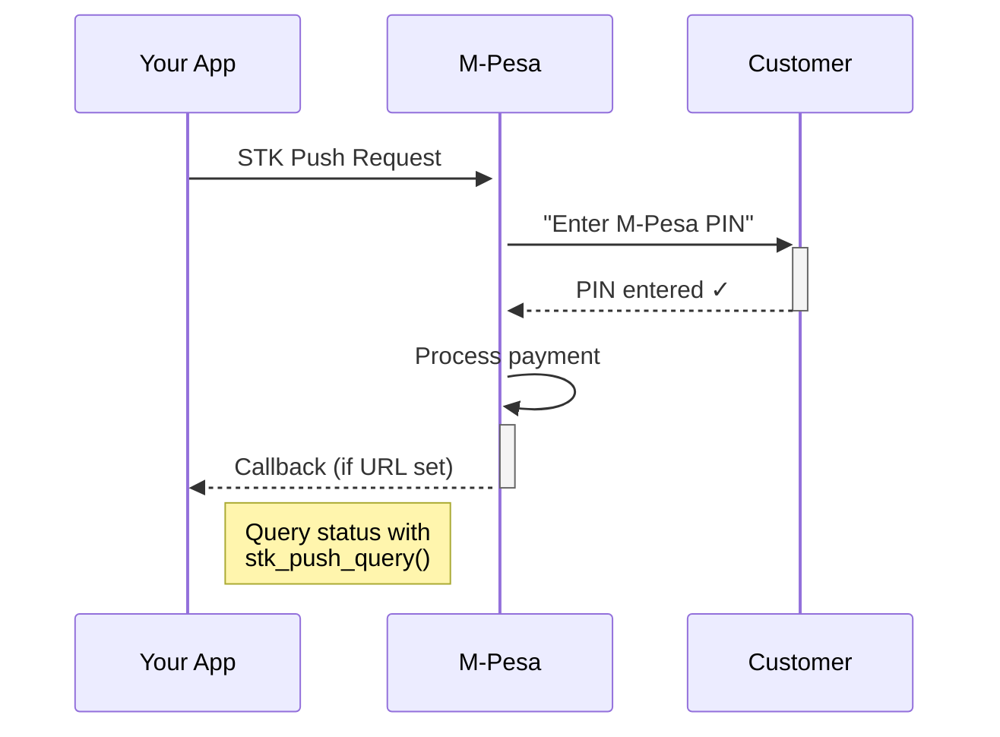

# Quickstart

This guide will get you from zero to a successful M-Pesa payment in under 2 minutes.

---

## 1. Install

```bash
pip install safcom
```

Works on Python 3.10+. No external system dependencies.

---

## 2. Get Your Credentials

You need four things from the [Safaricom Developer Portal](https://developer.safaricom.co.ke/):

| Credential | Where to find it |
|---|---|
| **Consumer Key** | Your app's dashboard → Consumer Key |
| **Consumer Secret** | Your app's dashboard → Consumer Secret |
| **Passkey** | Lipa Na M-Pesa Online → Passkey (also called "Security Credential" in some docs) |
| **Shortcode** | Your paybill/till number (e.g. `174379` for sandbox) |

!!! tip "Sandbox credentials"
    Don't have real M-Pesa credentials yet? Use the sandbox defaults:
    - Consumer Key: `YOUR_SANDBOX_KEY` (from developer portal)
    - Consumer Secret: `YOUR_SANDBOX_SECRET`
    - Passkey: `bfb279f9aa9bdbcf158e97dd71a467cd2e0c893059b10f78e6b72ada1ed2c919` (standard sandbox passkey)
    - Shortcode: `174379`

---

## 3. Send Your First STK Push

Create a file called `test_payment.py`:

```python
from safcom import Mpesa

# Create the client
mpesa = Mpesa(
    consumer_key="your_consumer_key",
    consumer_secret="your_consumer_secret",
    passkey="your_passkey",
    shortcode="174379",
    env="sandbox",  # ← Start with sandbox!
)

# Send an STK push to your phone
resp = mpesa.stk_push(
    phone="254712345678",   # Your number in 254 format
    amount=10,               # KES 10 (minimum)
    account_ref="TEST-001",  # Shows on the customer's M-Pesa screen
)

print(f"✅ STK push sent!")
print(f"   CheckoutRequestID: {resp.checkout_request_id}")
print(f"   Message: {resp.customer_message}")
```

Run it:

```bash
python test_payment.py
```

If everything is set up correctly, you'll see:

```
✅ STK push sent!
   CheckoutRequestID: ws_CO_202507202359590000
   Message: Please enter your M-Pesa PIN
```

And your phone will buzz with an M-Pesa PIN prompt.

!!! tip "No PIN prompt?"
    Make sure your phone number is in the correct format (`254` followed by 9 digits, no leading `0`). Also confirm your app is subscribed to the right APIs on the developer portal (Lipa Na M-Pesa Online).

---

## 4. What Just Happened

Here's the flow you just triggered:



- safcom handles the **OAuth token** automatically
- It formats the **password** and **timestamp** correctly (the parts developers always get wrong)
- It **normalises** your phone number (so `0712345678`, `254712345678`, `+254712345678` all work)
- It gives you a **typed response** — no trawling through raw JSON

---

## 5. Check the Result

After the customer enters their PIN, check if the payment succeeded:

```python
status = mpesa.stk_push_query("ws_CO_202507202359590000")

if status.success:
    print(f"✅ Paid! Receipt: {status.receipt}")
    print(f"   Amount: KES {status.amount}")
    print(f"   Date: {status.transaction_date}")
else:
    print(f"❌ Failed: {status.result_description}")
```

You ran your first safcom integration. Next steps:

- Set up a [callback URL](tutorial/stk-push.md#setting-up-callbacks) to get automatic payment notifications
- Learn about [error handling](guides/errors.md)
- Move to [production](tutorial/production.md) when you're ready
